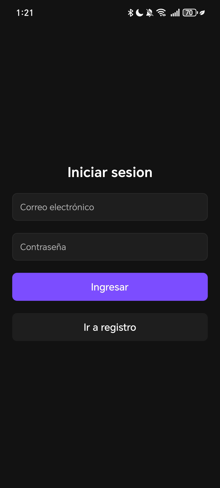
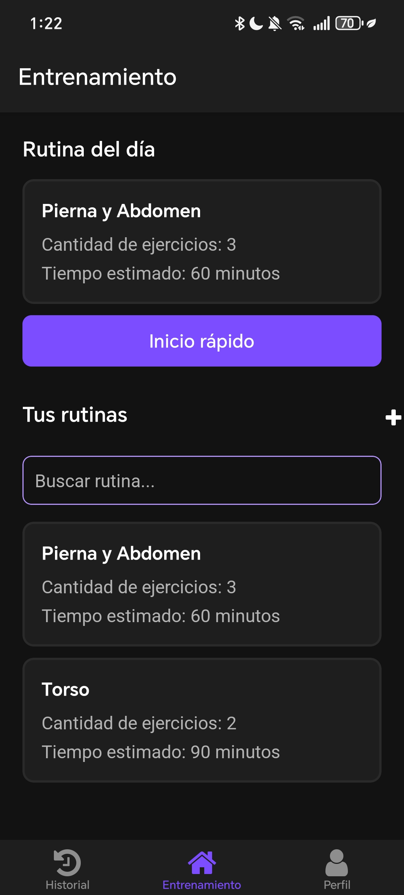
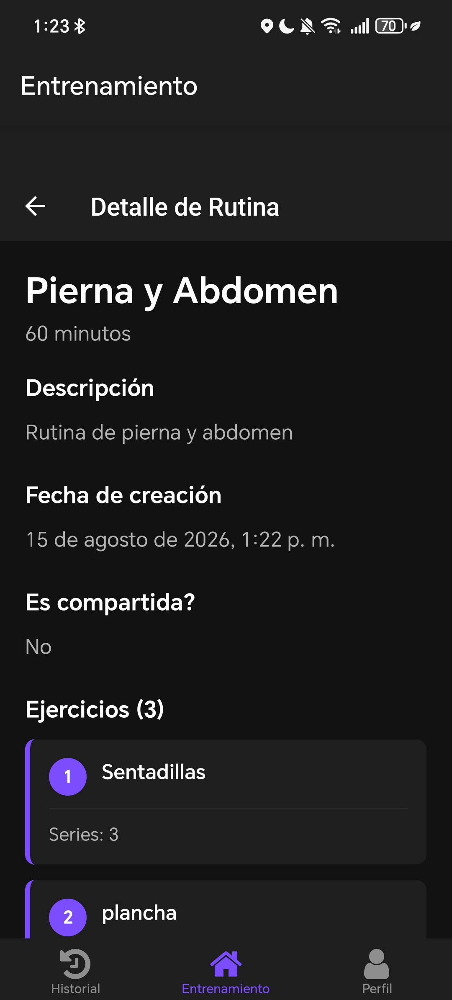
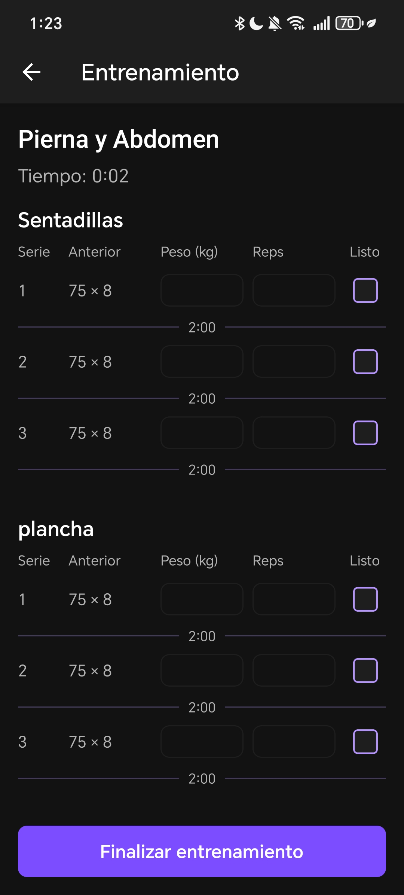

# FitLink — Gym Tracking Mobile Application

## Description

FitLink is a cross-platform mobile application for iOS and Android developed as a university project at the University of Costa Rica by a team of 3 developers. The app allows gym users to create custom workout routines from a predefined exercise list, start and log training sessions, track workout history and training statistics, and engage with a social layer that encourages interaction. Users can share routines, explore others' workouts, and save routines that match their goals.

## Tech Stack

**Framework:** React Native (Expo)  
**Language:** TypeScript  
**Backend & Auth:** Supabase  
**Testing:** Jest, React Testing Library  
**Quality:** SonarQube, Semgrep  
**Tools:** Git, GitHub, ESLint, Agile/Scrum  

## Features

- User authentication and session management via Supabase
- Create and manage custom workout routines from a predefined exercise library
- Configure routines with exercises, sets, descriptions, estimated workout time, and sharing options
- Start training sessions directly from any saved routine
- Smart "Routine of the Day" recommendation based on workout history and routine duration
- Log exercises with sets, reps, weights, and workout duration
- Track workout history organized by year and month
- View training statistics by week, month, year, or all-time
- Navigate between previous and current time periods to analyze training activity
- Track total workouts, training time, and exercises completed
- Share routines and explore workouts created by other users
- Save and manage routines for future workouts
- Cross-platform support for iOS and Android
- ~90% unit test coverage using Jest and React Testing Library
- Static code analysis with SonarQube and Semgrep

## Project Structure

```
FitLink/
├── assets/               # Images, fonts and static assets
├── src/
│   ├── app/              # Routed screens using Expo Router
│   ├── components/       # Reusable UI components
│   ├── constants/        # App constants and configuration
│   ├── containers/       # Container components
│   ├── hooks/            # Custom React hooks
│   ├── services/         # Supabase and API services
│   └── utils/            # Helper functions
├── tests/                # Unit and integration tests
├── app.json              # Expo configuration
├── eas.json              # EAS Build configuration
└── jest.config.js        # Jest configuration
```

## Demo

**Android APK** — Scan to download or [click here](https://expo.dev/accounts/erickhernandez18s-team/projects/fitlink-app/builds/93d87ab8-7691-4594-aa23-644c68b28aad)

<div align="center">
  
</div>

Enable "Install from unknown sources" in your device settings if prompted.

## Screenshots

<p align="center">
  
  &nbsp;&nbsp;&nbsp;&nbsp;
  
</p>

<p align="center">
  
  &nbsp;&nbsp;&nbsp;&nbsp;
  
</p>

## Getting Started

### Prerequisites

- Node.js v18 or higher — [Download here](https://nodejs.org/)
- Expo Go installed on your mobile device — [Download here](https://expo.dev/go)

### Installation

1. Clone the repository
```bash
   git clone https://github.com/erickhernandezdev/FitLink-App.git
```

2. Navigate to the project folder
```bash
   cd FitLink-App/FitLink
```

3. Install dependencies
```bash
   npm install
```

4. Set up environment variables
```bash
   cp .env.example .env
```

5. Run the project
```bash
   npx expo start
```

> **Note:** FitLink uses package versions recommended by Expo for maximum compatibility. Updating dependencies beyond Expo's recommendations may cause compatibility issues.

## Testing

This project uses Jest and React Testing Library to ensure component reliability across platforms.

Run all tests:
```bash
npx jest
```

Generate coverage report:
```bash
npx jest --coverage
```

Tests are located in the `/tests` directory and follow the `.test.tsx` naming convention.

## Linting

Run lint checks:
```bash
npx eslint .
```

Auto-fix issues:
```bash
npx eslint . --fix
```

## Environment Variables

Create a `.env` file in the root with the following structure:

```env
EXPO_PUBLIC_SUPABASE_URL=
EXPO_PUBLIC_SUPABASE_ANON_KEY=
```

## Team

Developed as a university project at the University of Costa Rica.

- [Erick Hernandez](https://github.com/erickhernandezdev)
- [Brayan Rivera Navarro](https://github.com/BrayanRiveraN)
- [Rolando Villavicencio González](https://github.com/RolandoVillavicencio013)

## License

This project was developed for academic purposes at the University of Costa Rica.